# 🎯 FOSSEE Workshop Booking UI/UX Enhancement


---

## 🚀 Overview

This project is a **UI/UX redesign** of the original FOSSEE Workshop Booking platform.

The goal was not to rebuild functionality, but to **enhance usability, visual clarity, and user experience** while keeping the **core structure and workflows intact**.

The redesign focuses on:

- Modern, clean interface
- Mobile-first responsiveness
- Improved accessibility
- Better visual hierarchy and navigation
- Performance-conscious design
- Basic SEO-friendly structure

---

## ⚡ Project Highlights (1-minute skim)

- 📱 Mobile-first redesign (students are primary users)
- 🎯 Clear user flow for key actions (login, register, explore workshops)
- 🧩 Reusable and structured React components
- ⚡ Lightweight implementation (no heavy UI libraries)
- 👁️ Improved readability and spacing
- 🔍 Better accessibility and semantic structure
- 🧭 Preserved original backend-driven flow and logic

---

## 🛠️ Tech Stack

- React
- Vite
- React Router
- CSS (custom styling, no heavy frameworks)

---

## ⚙️ Setup Instructions

### 1. Clone the repository
```bash
git clone <your-repo-link>
cd fossee-workshop-booking-redesign
```

### 2. Navigate to frontend
```bash
cd frontend
```

### 3. Install dependencies
```bash
npm install
```

### 4. Run development server
```bash
npm run dev
```

### 5. Build for production
```bash
npm run build
```

---

## 🎨 Design Principles

The redesign was guided by a few practical principles:

### 1. Mobile-First Approach
Since students primarily access the platform via mobile devices, layouts were designed for smaller screens first and then scaled up.

### 2. Clear Visual Hierarchy
Typography, spacing, and grouping were improved to make content easier to scan and actions easier to identify.

### 3. Consistency
Reusable components, consistent spacing, and uniform styling were maintained across all pages.

### 4. Reduced Clutter
The original system was functional but visually minimal. The redesign improves clarity without adding unnecessary complexity.

### 5. Action Visibility
Primary actions like login, register, and workshop interactions are now more prominent and easier to access.

---

## 📱 Responsiveness Strategy

Responsiveness was achieved using:

- Flexible layouts (Flexbox + Grid)
- Mobile-first breakpoints
- Stacked layouts for smaller screens
- Full-width interactive elements (buttons, inputs)
- Simplified navigation with toggle menu

All pages were tested for usability on smaller screens to ensure:
- readability
- touch accessibility
- smooth navigation

---

## ♿ Accessibility Improvements

- Semantic HTML structure
- Proper heading hierarchy
- Improved color contrast
- Larger clickable areas for mobile users
- Clear form structure and labels

These changes help make the interface more usable for a wider range of users.

---

## 🔍 SEO Considerations

Although this is a frontend-focused redesign, basic SEO practices were followed:

- Semantic HTML usage
- Proper heading structure
- Cleaner page structure for better indexing
- Avoidance of unnecessary heavy scripts

---

## ⚖️ Design vs Performance Trade-offs

Some conscious decisions were made:

- ❌ Avoided heavy UI libraries to reduce bundle size  
- ❌ Avoided complex animations to maintain performance  
- ✅ Used simple CSS for faster rendering  
- ✅ Focused on structure and clarity over decorative elements  

This ensures the application remains lightweight and fast.

---

## 🧠 Most Challenging Part

The biggest challenge was redesigning a system originally built with **Django templates** into a **React-based frontend**, while preserving:

- existing user flows  
- page structure  
- core functionality  

### Approach:
- Studied the original repository thoroughly  
- Identified key user journeys  
- Recreated those flows in React  
- Built reusable layout and styling patterns  
- Iteratively improved each page  

---

## 📄 Pages Redesigned

- Home  
- Login  
- Register  
- Workshop Types  
- Propose Workshop  
- Profile  
- Workshop Status  
- Statistics  

---

## 🖼️ Visual Showcase (Before vs After)

### 🏠 Home
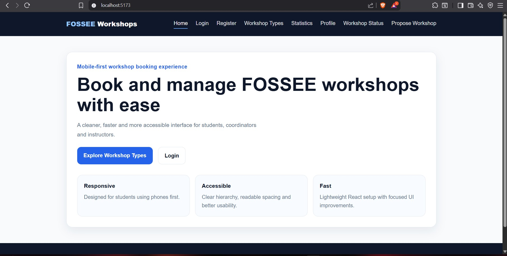

---

### 🔐 Login
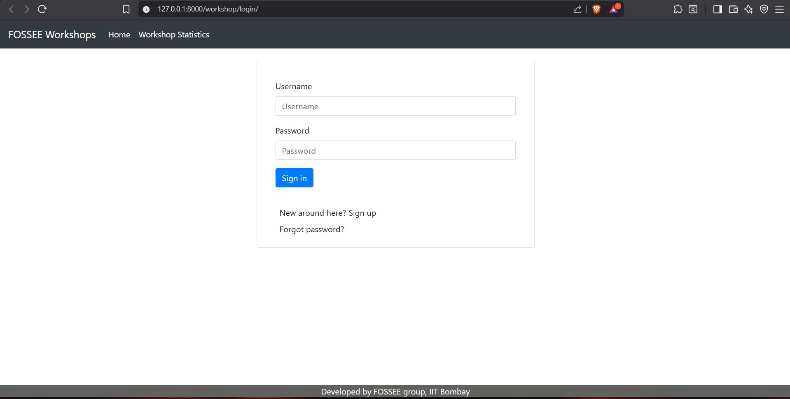
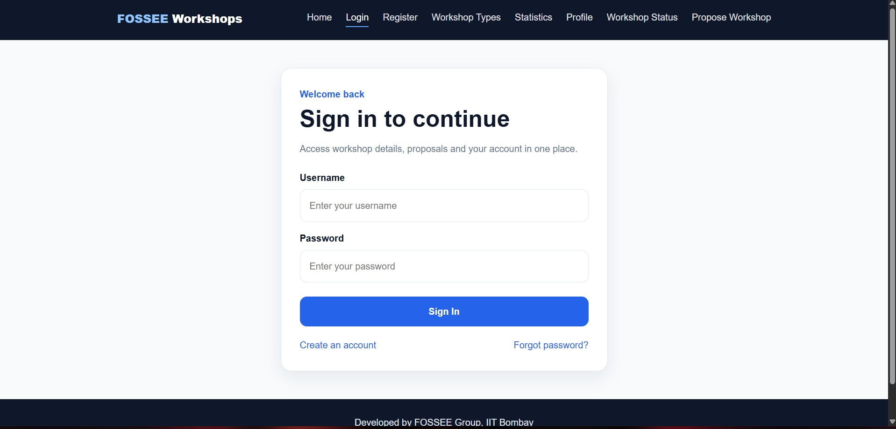

---

### 📝 Register
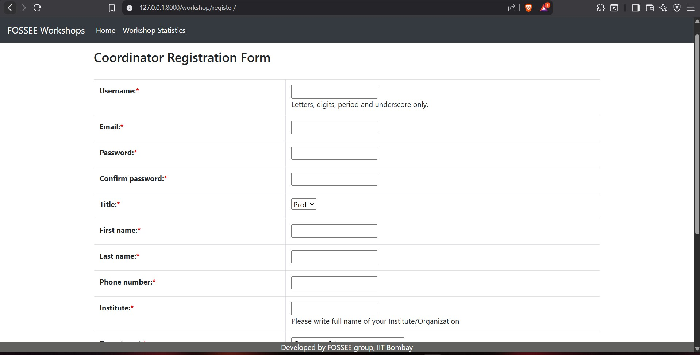
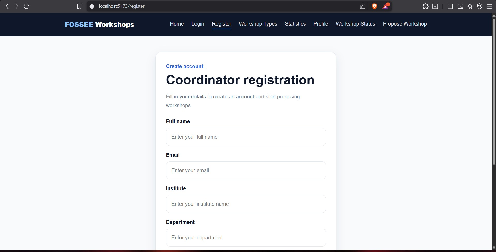

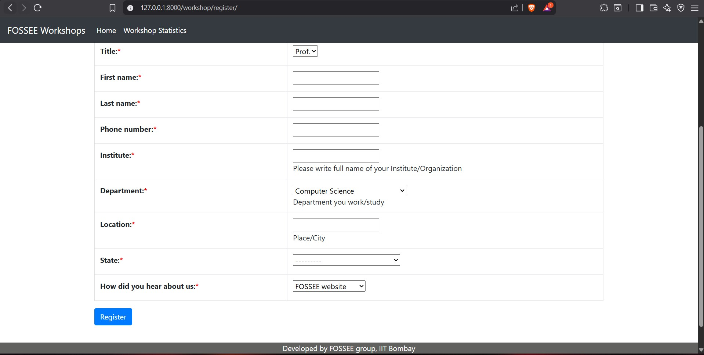
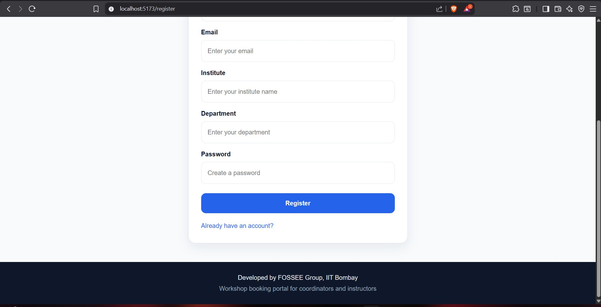

---

### 📊 Workshop Types
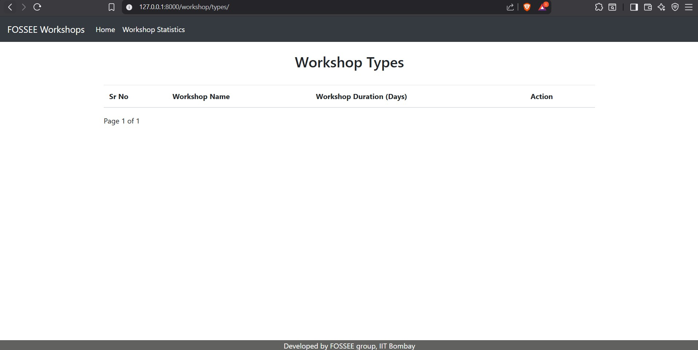
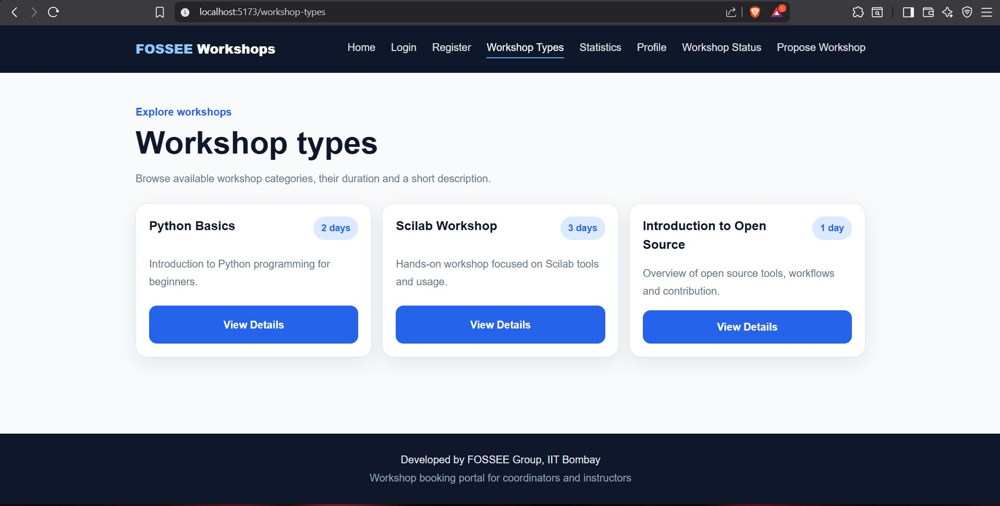

---

### 📈 Workshop Statistics
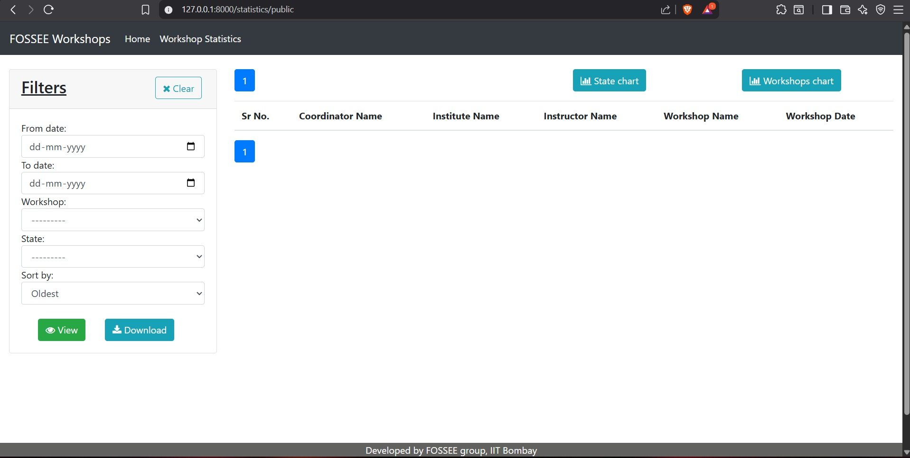
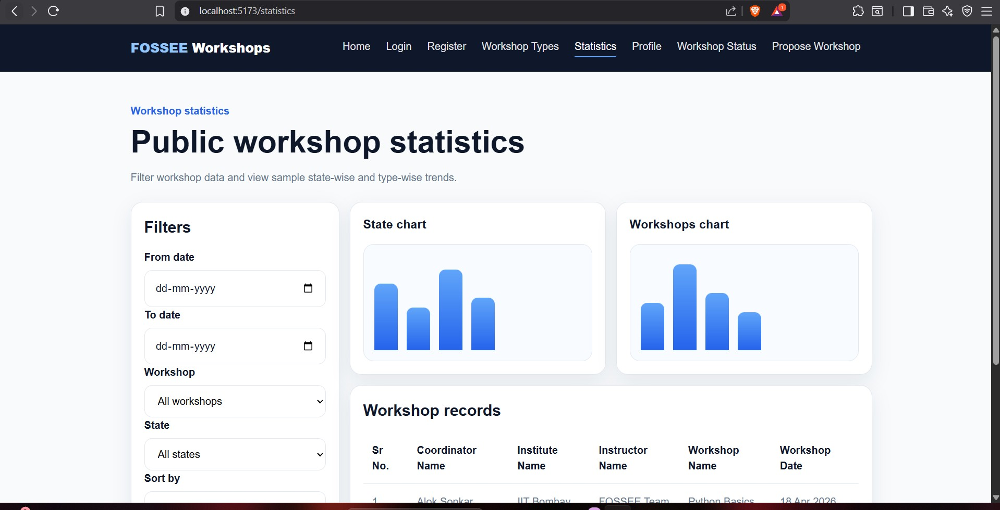
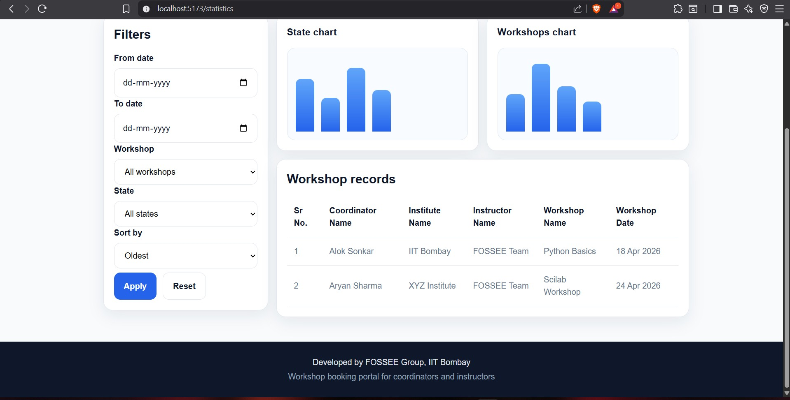

---

### 📌 Workshop Status
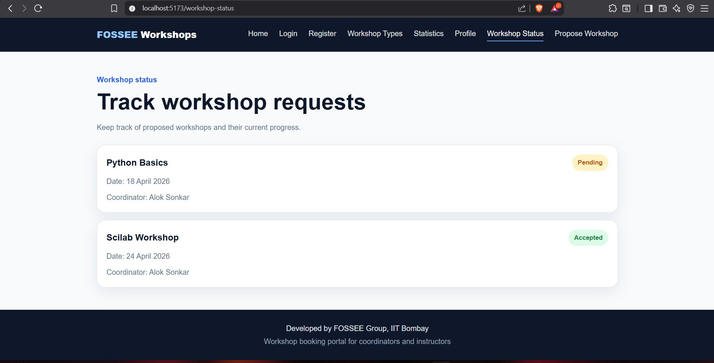

---

### 💡 Propose Workshop
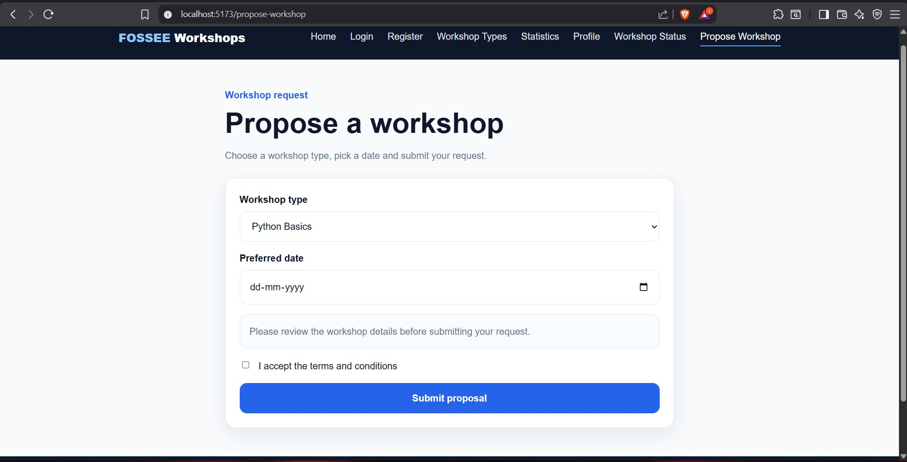

---

### 👤 Profile
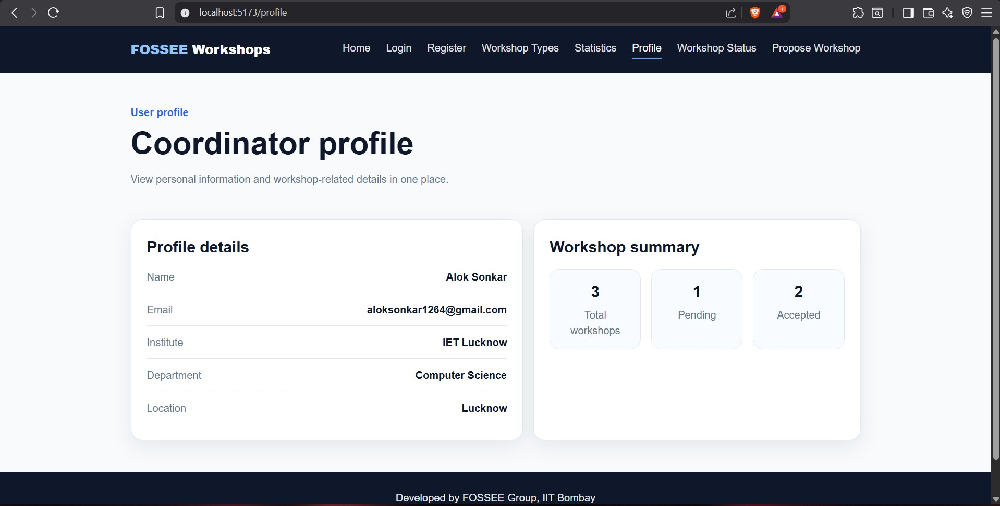

---

## 📝 Notes

This project focuses on improving **user experience without disrupting the original system design**.

The goal was to make the platform:
- easier to use  
- more readable  
- visually structured  
- mobile-friendly  
- performance efficient  

---

## ✅ Submission Checklist

- [x] Clean and structured code  
- [x] Progressive development (not a single dump)  
- [x] README with reasoning and setup  
- [x] Before/after screenshots included  
- [x] Responsive and accessible design  

---

## 📬 Submission

Repository Link: `https://github.com/AlokSonkar007/fossee-workshop-booking-redesign`

---
